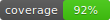

# FESF-SUS — Sistema de Triagem



Sistema web para gestão de triagem hospitalar da Fundação Estatal Saúde da Família, permitindo o cadastro de pacientes e a classificação por cor de risco (verde, amarelo, laranja e vermelho) com controle de acesso por perfil de usuário (recepcionista, enfermeiro e médico). O backend é construído em FastAPI com PostgreSQL e o frontend em Next.js.

---

## Testes

Os testes rodam de forma totalmente independente — sem Docker, sem PostgreSQL, sem servidor ativo.
O backend usa SQLite em memória e o frontend usa jsdom. Basta instalar as dependências e executar.

### Backend — Pytest

```bash
cd backend

# Instalar dependências de desenvolvimento (apenas na primeira vez)
pip install -r requirements-dev.txt

# Rodar todos os testes com relatório de cobertura
pytest --cov=app --cov-report=html:coverage --cov-fail-under=80

# Apenas testes unitários
pytest -m unit

# Apenas testes de integração
pytest -m integration
```

O relatório HTML de cobertura é gerado em `backend/coverage/index.html`.

### Frontend — Jest + React Testing Library

```bash
cd frontend

# Instalar dependências (apenas na primeira vez)
npm install

# Rodar todos os testes
npm test

# Rodar com relatório de cobertura
npm run test:coverage
```

### Estrutura dos testes

```
backend/
└── tests/
    ├── conftest.py               # Fixtures globais (banco, client HTTP, usuários, tokens)
    ├── unit/
    │   ├── test_jwt.py           # Geração e verificação de tokens JWT
    │   ├── test_schemas.py       # Validação Pydantic (CPF, data nascimento, queixa)
    │   └── test_fila_ordering.py # Lógica de prioridade da fila de triagem
    └── integration/
        ├── test_auth.py          # Endpoints /auth (login, me, logout)
        ├── test_pacientes.py     # Endpoints /pacientes (CRUD + auth)
        └── test_triagens.py      # Endpoints /triagens (criação, fila, RBAC)

frontend/
└── __tests__/
    ├── LoginPage.test.tsx        # Formulário de login (render, erro, redirect)
    ├── TriagemCard.test.tsx      # Card de triagem (cores, CPF formatado)
    ├── TriagemFila.test.tsx      # Fila via Zustand real (setState)
    ├── helpers/
    │   └── mockStore.ts          # Helper mockAuthStore() / mockTriagemStore()
    └── integration/
        └── login-flow.test.tsx   # Fluxo completo: form → API → Zustand → redirect
```
